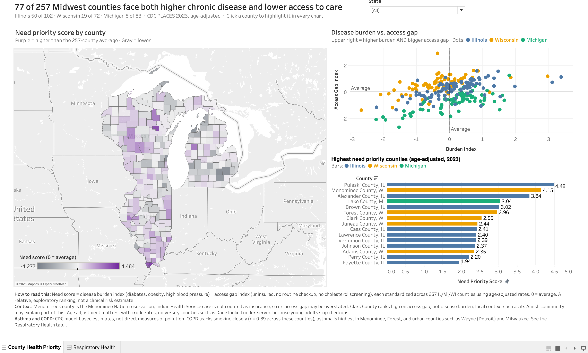
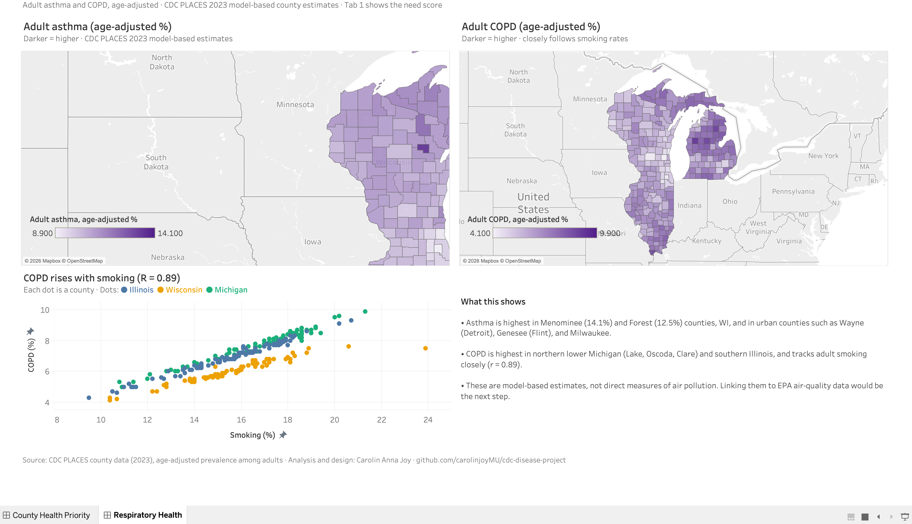

# CDC PLACES county priority dashboard

An exploratory analysis of 257 counties in Illinois, Michigan, and Wisconsin using six CDC PLACES prevalence estimates. The project builds a relative priority score, explores it with SQL, and presents the results in Tableau.



## Key findings from the 2023 measures

- 257 counties have all six selected measures: 102 in Illinois, 83 in Michigan, and 72 in Wisconsin.
- **77 counties** have both an above-average burden index and an above-average access gap index (50 IL, 19 WI, 8 MI).
- Pulaski County, Illinois has the highest combined score (4.48), followed by Menominee County, Wisconsin (4.15) and Alexander County, Illinois (3.84).
- The unweighted average county score is 0.357 in Illinois, 0.184 in Wisconsin, and -0.598 in Michigan. These are county averages, not population-weighted state estimates.

## Data and method

Source: [CDC PLACES county dataset `swc5-untb`](https://data.cdc.gov/resource/swc5-untb.json). The repository includes the downloaded `swc5-untb.json` snapshot so the pipeline can be rerun without an API key. The six selected measures in this snapshot are labeled 2023 and have both crude and age-adjusted values. This analysis uses **age-adjusted prevalence**, so counties with older or younger populations are compared fairly. With crude rates, university counties such as Dane looked under-served because young adults skip routine checkups.

| Index | PLACES measure IDs | Direction used in the score |
| --- | --- | --- |
| Burden | `DIABETES`, `OBESITY`, `BPHIGH` | Higher prevalence raises burden |
| Access gap | `ACCESS2` | Higher uninsured prevalence raises the gap |
| Access gap | `CHECKUP`, `CHOLSCREEN` | Higher screening/checkup prevalence lowers the gap |

For each measure, the script calculates a z-score across the 257 complete counties: `(county value - mean) / population standard deviation`. It averages the three burden z-scores and the three access z-scores, reversing the signs of `CHECKUP` and `CHOLSCREEN`. The final score is the sum of those two indices, with equal weight. See [CDC measure definitions](https://www.cdc.gov/places/measure-definitions/index.html).

The score is an **exploratory ranking**, not a CDC metric or clinical risk estimate. Checkup and cholesterol screening are proxies for service use, not direct measures of health-care availability. A score of zero means average relative to this selected group of counties. Scores from separately standardized years should not be interpreted as absolute changes over time.

## Reproduce the data

Python 3.9 or later is sufficient; no third-party packages are required.

```bash
python3 fetch_places_data.py
python3 compute_scores.py
python3 load_scores_sqlite.py
sqlite3 -header -column county_health.db < analysis.sql
```

The files flow as follows:

```text
swc5-untb.json
  -> places_raw_long.csv       (six measures, one county-measure row)
  -> county_priority_scores.csv (one scored row per county)
  -> county_health.db           (SQLite table for SQL analysis)
```

`analysis.sql` contains the ranking, state summary, and high-burden/high-gap queries. `county_health.db` is generated locally and excluded from Git. Tableau connects directly to `county_priority_scores.csv`.

## Dashboard

The dashboard has two tabs:

- **County Health Priority**: need-score map, burden vs. access-gap scatter, and the highest-priority counties.
- **Respiratory Health**: adult asthma and COPD (age-adjusted) maps, and COPD vs. smoking across counties (r = 0.89).



The Tableau workbook belongs in `dashboard/` as a packaged workbook (`.twbx`). See [dashboard/build-guide.md](dashboard/build-guide.md) for the exact worksheets, layout, and validation checks. A packaged workbook includes the CSV snapshot, so it can be opened without the original file path. The public Tableau URL will be added here after publication.

## Year-over-year scope

The included snapshot has 2022 rows for five *other* measures, but only 2023 rows for the six measures used in this score. A comparison dashboard needs an earlier PLACES release with the same six measures and a check that definitions are comparable. The current workbook should label the analysis **2023 measure year**.
